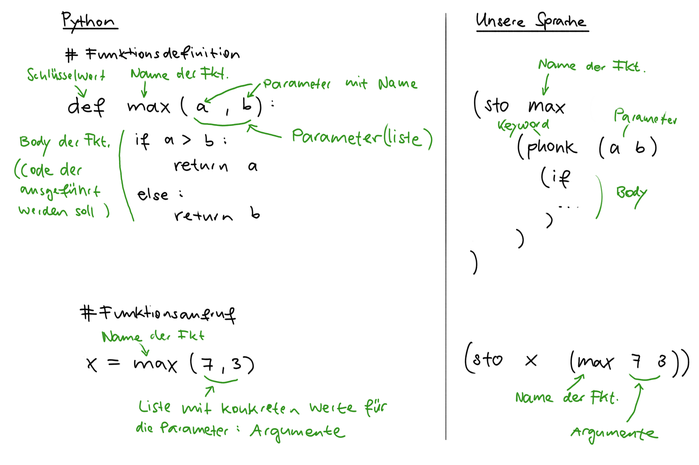

# Eine eigene Programmiersprache

## Inhalt
* [Begriffe](#begriffe)
* [Basis](#basis)
   * [Syntax](#syntax)
   * [Interne Darstellung eines Programms](#interne-darstellung-eines-programms)
   * [Phasen der Ausführung](#phasen-der-ausführung)
        * [Tokenize-Phase](#tokenize-phase)
        * [Parse-Phase](#parse-phase)
        * [Evaluate-Phase](#evaluate-phase)
   <!-- * Erweiterte Phasen (optional) -->
* [Schritt 1: Einfacher Taschenrechner](#schritt-1-einfacher-taschenrechner)
* [Schritt 2: Taschenrechner mit Konstanten](#schritt-2-taschenrechner-mit-konstanten)
* [Schritt 3: Taschenrechner mit Variablen](#schritt-3-taschenrechner-mit-variablen)
* [Schritt 4: Funktionen, erste Version](#schritt-4-funktionen-erste-version)
* [Schritt 5: Funktionen mit Environments](#schritt-5-funktionen-mit-environments)
* [Schritt 6: Funktionen nutzen (Blöcke und Library)](#schritt-6-funktionen-nutzen-blöcke-und-library)

## Begriffe
* **Host-Programmiersprache**: Die Programmiersprache, welche benutzt wurde, um eine Programmiersprache zu programmieren.  Bei uns ist das Python, bei Python ist es C.
* **Interpreter**: Das Programm, welches den in unserer Programmiersprache geschriebenen Code ausführt.
* **Tokenize**: Erste Phase bei der Ausführung eines Programms. Der Text mit dem Code wird zuerst in logische Blöcke aufgeteilt.  Zum Beispiel `"(+ 1.1 5.5)"` in `"("`, `"+"`, `1.1`, `5.5` und `")"`.
* **Parse**: Zweite Phase bei der Ausführung eines Programms. Das Übersetzen der Liste der Tokens in die _interne Darstellung_.
* **Interne Darstellung**: Interne Darstellung eines Programms, oft in einer Baum-ähnlichen Struktur.  Bei uns wird ein Programm mit verschachtelten Listen, Strings und Zahlen dargestellt.
* **Evaluate**: Dritte Phase bei der Ausführung eines Programms. Die interne Darstellung Schritt für Schritt ausführen, um am Schluss zu einem Resultat zu gelangen.
* **Schlüsselwort**: Wort, welches in einer Programmiersprache eine spezielle Bedeutung hat, und darum zum Beispiel nicht als Variablen- oder Funktionsnamen verwendet werden darf.  In unserer Sprache beispielsweise `sto`, oder `def` in Python.
* **Eingebaute Funktion**: Eine Funktion, welche in unserer Programmiersprache benutzt werden kann, aber in der Host-Programmiersprache programmiert wurde. Zum Beispiel `add` für die Addition zweier Zahlen.
* **Library-Funktion**: Eine Funktion, welche in unserer Programmiersprache benutzt werden kann und auch in unserer Programmiersprache programmiert wurde.  Die Library-Funktionen werden vor der Ausführung eines Programms geladen.
* **Lokale Variablen**: Variablen, welche nur innerhalb einer Funktion existieren.  Also alle Argumente der Funktion und auch alle Variablen, welche innerhalb der Funktion definiert wurden.
* **Environment**: Ort um Werte wie Variablen und Funktionen abzuspeichern.  Das Environment ändert sich, und ist beispielsweise innerhalb einer Funktion anders als ausserhalb.  Für Environments verwenden wir Pythons `ChainMap`-Datenstruktur.
* **Rekursion**: Funktionen die sich selber aufrufen. Zum Beispiel eine Funktion welche die Fakultät einer Zahl berechnet.


## Basis

Wir schreiben unsere eigene Programmiersprache in Python.  Dazu bestimmen wir zuerst wie unsere Sprache aussehen soll.

### Syntax

Unsere Sprache lehnt sich vom Aussehen her an eine der ältesten Programmiersprachen an, welche immer noch aktiv verwendet wird: LISP.

Jede Operation in unserer Sprache wird dabei in Klammern geschrieben, mit dem Namen der Operation als erstes, gefolgt von den Argumenten. Als Trennzeichen braucht es kein Komma sondern ein einfaches Leerzeichen genügt.

Beispiel:
```lisp
(+ 1 3)
```

Operationen können beliebig verschachtelt werden:
```lisp
(+ 1 (* (- 7 2 ) 4))
```

Die Syntax ist im Vergleich zu Python nicht sehr leserlich, aber sehr einfach, und dadurch gut geeignet für Experimente.

### Interne Darstellung eines Programms

Ein Programm wird normalerweise in einer Textdatei geschrieben, auch Source-Code genannt.  Wir können den Inhalt der Datei als String einlesen.  Dieser String wird dann in die _interne Darstellung_ übersetzt.  Da unsere Syntax sehr einfach ist, entspricht die interne Darstellung fast exakt dem ursprünglichen Source-Code.  Wir verwenden dazu Listen, Strings und Zahlen (`int` und `float`).

_Beispiel:_

Source-Code:
```lisp
(+ (- 5 4) (* (- 7 2 ) 4))
```

Interne Darstellung in Python:
```py
['+', ['-', 5, 4], ['*', ['-', 7, 2], 4]]
```

Die interne Darstellung kann man auch als "Baum" darstellen.  (Nun ja, irgendwie wachsen die Äste gegen unten ...)

```py
    ['+',   …   ,    …]
            🡓        🡓
    ['-', 5, 4]    ['*', …, 4]
                         🡓
                       ['-', 7, 2]
```
Wegen dieser Baum-ähnlichen Struktur wird die _interne Darstellung_ oft auch _Syntax Tree_ genannt.

### Phasen der Ausführung

Um vom Source-Code zu einem ausgeführten Programm zu gelangen sind (mindestens) drei Schritte nötig.  Diese Schritte werden im Informatikjargon _Phasen_ genannt.

#### Tokenize-Phase

In der ersten Phase wird der (lange) String mit dem Source-Code in Teile aufgetrennt, welche logisch zusammengehören. Zum Beispiel gehören bei `2.18` alle vier Zeichen zur gleichen Zahl.  Aus dem String `2 18`  werden jedoch zwei Tokens: `2` und `18`.  Die logischen Einzelteile werden _Tokens_ genannt.  Und darum heisst diese erste Phase auch _tokenize_.

Der Tokenizer-Code ist Dank eines Tricks sehr kurz:
```py
def tokenize(program):
    return program.replace("(", " ( ").replace(")", " ) ").split()
```

#### Parse-Phase

In der zweiten Phase wird die Liste mit Tokens in die interne Darstellung umgewandelt.  Die Phase wird `parse` genannt, und besteht bei uns aus zwei Teilen:

Einerseits wird mit Listen die Struktur des Programms wiedergeben:
```py
def parse(tokens):
    token = tokens.pop(0)
    if token == '(':
        lst = []
        while tokens[0] != ')':
            lst.append(parse(tokens))
        tokens.pop(0)
        return lst
    else:
        return parse_atom(token)
```
Der Code dazu ist zwar kurz, aber ziemlich schwer verständlich.  Wir vertrauen einfach mal darauf, dass er funktioniert.

Andererseits benutzten wir die Python-Funktionen `int` und `float`, um Strings, die Zahlen enthalten auch in Zahlen (`int` oder `float`) umzuwandeln:
```py
def parse_atom(token):
    if token[0] in "+-.0123456789" and token != "+" and token != "-":
        # Token scheint eine Zahl zu sein (hoffentlich)
        if "." in token:
            # Float mit einem Dezimalpunkt
            return float(token)
        else:
            # Int
            return int(token)
    else:
        return token
```

Bei Sprachen mit einer schönen Syntax ist die `parse`-Phase sehr komplex, und war lange ein zentrales Problem in der Informatikforschung.  Zum Beispiel musste bei Python der komplett `parse`-Code ersetzt werden, um die neue `match`-`case`-Syntax einführen zu können.

#### Evaluate-Phase
In der dritten und letzten Phase wird die interne Darstellung des Programms ausgewertet, oder auf Englisch _evaluated_.

Die Auswertung geschieht rekursiv.

Was passiert zum Beispiel wenn die folgende Rechnung ausgeführt werden soll?
```lisp
(+ (- 5 4) (* (- 7 2 ) 4))
```

In den ersten zwei Phasen wird der Code in die interne Darstellung übersetzt:
```py
['+', ['-', 5, 4], ['*', ['-', 7, 2], 4]]
```

Jetzt können wir schrittweise den Code ausführen.  Zur besseren Übersicht verwenden wir hier die Baum-ähnliche Darstellung:

1. Äusserste Liste mit der Addition versuchen zu evaluieren:
```py
    ['+',   …   ,    …]           # Muss zuerst Argumente evaluieren
            🡓        🡓
    ['-', 5, 4]    ['*', …, 4]
                         🡓
                       ['-', 7, 2]
```

2. Erstes Argument der Addition (`['-', 5, 4]`) evaluieren:
```py
    ['+',   …   ,    …]
            🡓        🡓
            1      ['*', …, 4]
                         🡓
                       ['-', 7, 2]
```

3. Zweites Argument der Addition (`['*', ['-', 7, 2], 4]`) evaluieren:
```py
    ['+',   1   ,    …]
                     🡓
                   ['*', …, 4]    # Muss zuerst Argumente evaluieren
                         🡓
                       ['-', 7, 2]
```

4. Erstes Argument der Multiplikation (`['-', 7, 2]`) evaluieren:
```py
    ['+',   1   ,    …]
                     🡓
                   ['*', …, 4]
                         🡓
                         5
```
5. Jetzt kann man die Multiplikation `['*', 5, 4]` evaluieren:
```py
    ['+',   1   ,    …]
                     🡓
                     20
```
6. Und erst jetzt die äusserste Addition `['+', 1, 20]` evaluieren:
```py
    21
```


## Schritt 1: Einfacher Taschenrechner

In einem ersten Schritt geht es darum, eine verschachtelte Rechnung zu berechnen.

Um überhaupt etwas berechnen zu können, brauchen wir eine gewisse Anzahl von nützlichen Operation wie Plus, Minus und so weiter.  Wir schreiben dazu Funktionen in Python und speichern sie unter dem gewünschten Symbol in einem `dict` ab.

```py
def add(a, b):
    return a + b

...

operators = {
    '+': add,
    '-': sub,
    '*': mult,
    ...
}
```

In der Analogie zum Taschenrechner entsprechen diese _eingebauten Funktionen_ den einzelnen Tasten auf dem Rechner.

Bei der Berechnung einer verschachtelten Rechnung können zwei Fälle auftreten:
1. Eine Zahl kann direkt wieder zurück gegeben werden.
2. Bei einer Rechnung sind mehrere Schritte nötig:
     * Funktion für den Operator in den `operators` nachschlagen.
     * Alle Argumente evaluieren, denn vielleicht ist da ja noch eine Rechnung mit dabei.  Hier ruft sich `evaluate` selber &ndash; also rekursiv &ndash; auf.
     * Funktion mit den berechneten Werte für die Argumenten aufrufen, und das Resultat zurück geben.

```py
def evaluate(expr):
    match expr:
        # Einfache Werte
        case int(num) | float(num):
            return num
        # Operationen ausführen
        case [operator, *args]:
            function = operators[operator]
            args = [evaluate(arg) for arg in args]
            return function(*args)
        # Unbekannter Ausdruck
        case _:
            raise ValueError("Unbekannter Ausdruck")
```

## Schritt 2: Taschenrechner mit Konstanten

Ein Taschenrechner hat oft auch Tasten für viel verwendete Konstanten wie $\pi$.  Die Tasten für Konstanten und Operationen unterscheiden sich dabei nicht.  Auch in Python werden Funktionen und Werte am selben Ort abgespeichert.

Um das zu verdeutlichen, können unsere `operators` zu `operators_and_constants` umbenennen.

```python
import math
import random

operators_and_constants = {
    "+": add,
    "-": sub,
    "*": mult,
    "/": div,
    "expt": pow,
    "sin": math.sin,
    "cos": math.cos,
    "pi": math.pi,
    "e": math.e,
    "random": random.random,
}
```

Den `evaluate`-Code passen wir entsprechend an, so dass einzelne Namen wie `+`, `sin` oder `pi` in den oben definierten `operators_and_constants` nachgeschlagen werden.

```python
def evaluate(expr):
    match expr:
        case int(number) | float(number):
            return number
        case str(name):
            return operators_and_constants[name]
        case [operator, *args]:
            function = evaluate(operator)
            args = [evaluate(arg) for arg in args]
            return function(*args)
        case _:
            raise ValueError("Unbekannter Ausdruck")
```

Dadurch, dass wir einen separaten Case für das Nachschlagen von Namen machen, können wir später unseren Code einfacher erweitern.

## Schritt 3: Taschenrechner mit Variablen

Selbst bei einfachen Taschenrechnern können Werte zwischengespeichert werden. Darum möchten wir beliebige Werte unter beliebigen Namen abspeichern können.

Die erste Frage, die sich stellt, lautet: Wo speichern wir die Variablen ab? In einem separaten `dict` oder zusammen mit den Operatoren und Konstanten in `operators_and_constants`?

Schauen wir uns einmal an wie dies in Python funktioniert:

```py
>>> ausdrucken = print
>>> ausdrucken("hallo")
hallo
>>> print = 5
>>> ausdrucken(print)
5
```
Die Funktion `print` kann in der Variablen `ausdrucken` abgespeichert werden, und dann wieder als Funktion aufgerufen werden.  Und der Name der Funktion `print` kann als Variablennamen verwendet werden (auch wenn das vielleicht nicht sehr schlau scheint).  Python verwendet also ein und denselben Ort um Variablen _und_ Funktionen abzuspeichern.  Wir wollen das ähnlich handhaben, und machen darum keinen Unterschied zwischen Operatoren, Konstanten oder durch den oder die Benutzer:in definierte Variablen.  Dazu benennen wir `operators_and_constants` zu `operators_constants_and_variables` um. Gut, dass wir diesen `dict` and nur ganz wenigen Stellen verwenden.  (Wir finden dann schon noch einen besseren Namen, versprochen!)

Zweitens stellt sich die Frage nach einer sinnvollen Syntax für die Definition von Variablen. Wir haben uns für das Schlüsselwort `sto` geeinigt, wie wir das von Taschenrechnern zum Abspeichern von Werten (engl. _store_) her kennen.  Das Schlüsselwort wird gefolgt vom Namen der Variablen und vom Wert, der abgespeichert werden soll.

Zum Beispiel:
```scheme
> (sto x 9)
9
> (+ x 2)
11
```

Damit das Ganze funktioniert, muss die Funktion `evaluate` erweitert werden:
```py
def evaluate(expr):
    match expr:
        # Einfache Werte
        ...
        case str(name):
            return operators_constants_and_variables [name]

        # Spezialkonstrukte
        case ["sto", name, value]:
            value = evaluate(value)
            operators_constants_and_variables [name] = value
            return value
        ...
```

Wenn also anstelle einer Zahl ein Name kommt, schlagen wir den in den `operators_constants_and_variables` nach, und geben den gefundenen Wert zurück.

Das Abspeichern einer Variablen muss ein Spezialkonstrukt sein, denn der Name der Variablen existiert zu diesem Zeitpunkt noch gar nicht.  Wenn einen neue Variable definiert wird, muss zuerst der Wert berechnet werden, der abgespeichert werden soll. Erst danach kann der berechnete Wert unter dem angegebenen Namen in `operators_constants_and_variables` abgespeichert werden.

Jetzt können wir sogar Resultate von Rechnungen abspeichern:

```scheme
> (sto x (+ 2 3))
> (sto y (* x x))
> y
25
```

## Schritt 4: Funktionen, erste Version

Jetzt wollen wir unseren "Rechner" zu einem programmierbaren Rechner erweitern.  Wir wollen also eigene Funktionen in unserer eigenen Sprache schreiben, welche wir danach aufrufen können.  In der ersten Version werden unsere Funktionen noch nicht ganz so funktionieren, wie wir das von den bekannten Programmiersprachen her gewohnt sind.

Bevor wir loslegen können, müssen wir uns Gedanken zur Syntax machen.  Mit `sto` haben wir bereits einen Weg gefunden, um etwas unter einem Namen abzuspeichern.  Wir brauchen also zusätzlich noch einen Weg, wie wir eine Funktion mit ihren Parametern schreiben wollen.  Dazu betrachten wir zuerst die Definition und das Ausführen von Funktionen in Python, um uns danach für unsere eigene Syntax zu entscheiden.



Als Schlüsselwort verwenden wir `phonk`, gefolgt von der Liste mit den Parametern und zuletzt dem Body der Funktion, also dem eigentlichen Code der ausgeführt werden soll.

Ein weiteres Beispiel könnte so aussehen:

```scheme
(sto square        ; <- Unter dem Namen `square` abspeichern
    (phonk (x)     ; <- Definition einer Funktion (ohne Namen) mit einem Parameter mit dem Namen `x`
        (* x x)    ; <- Body der Funktion
    )
)

(square 5)         ; <- Die oben definierte Funktion ausführen, mit 5 als Argument
```

Denselben Code auf jeweils einer Zeile:
```scheme
(sto square (phonk (x) (* x x)))
(square 5)
```

Der Code einer Funktion wird bei der Definition nicht ausgeführt, sondern abgespeichert.  Darum muss die Definition einer Funktion mit `phonk` ist ein Spezialkonstrukt unserer Sprache sein.  Der Code dazu ist sehr einfach.  Wir können einfach die Liste mit den Namen der Parameter und den Body der Funktion unverändert zurück geben.  Der _Body_ der Funktion ist der Code, welcher ausgeführt werden soll, wenn die Funktion aufgerufen wird.
```py
def evaluate(expr):
    match expr:
        ...
        # Spezialkonstrukte
            ...
        case ["phonk", params, body]:
            return ["phonk", params, body]
```


Beim Ausführen der Funktion wird es etwas komplizierter.  Am Anfang bleibt alles wie gehabt. Wir holen die Funktion aus den `operators_constants_and_variables`, welches wir mittlerweile zu `everything` umbenannt haben, und evaluieren alle Argumente.  Danach müssen wir unterscheiden, um was für eine Funktion es sich handelt:
 * Eine Funktion, welche in unserer Sprache geschrieben wurde
 * Eine in Python geschriebene _eingebaute Funktion_

Unsere eigenen Funktionen sind Listen aus dem Schlüsselwort `phonk`, den Namen der Parameter und dem Body der Funktion.  Alles andere ist dann (hoffentlich) eine in Python geschriebene Funktion:

```py
def evaluate(expr):
    match expr:
        ...
        # Funktionen
        case [operator, *args]:
            function = evaluate(operator)
            args = [evaluate(arg, env) for arg in args]

            match function:
                # "Eigene" Funktion
                case ["phonk", params, body]:
                    for i in range(len(params)):
                        value = args[i]
                        name = params[i]
                        everything[name] = value
                    return evaluate(body)

                # Python Funktion
                case _:
                    return func(*args)
```

Bei den eingebauten Python-Funktionen ganz unten ist alles wie bisher: Direkt aufrufen.

Bei unseren "eigenen" Funktionen sind zwei Schritte nötig:
1. Die übergebenen Werte (Argumente) müssen unter den in der Funktionsdefinition angegebenen Parameternamen abgespeichert werden.
2. Der Body wird evaluiert und das erhaltene Resultat zurück gegeben.

_Bemerkung:_ Bei den beiden Begriffe Parameter und Argumente einer Funktion droht Verwechslungsgefahr. Als Parameter bezeichnet man die Liste von Namen bei der _Definition_ einer Funktion.  Die konkreten Werte, welche dann beim _Aufruf_ einer Funktion übergeben werden, nennt man hingegen Argumente.  Sie zu verwechseln ist aber oft nicht weiter schlimm, denn meistens ist trotzdem klar, was gemeint ist. In der Python-Welt werden diese beiden Begriffe aber ziemlich konsistent wie beschrieben verwendet.


## Schritt 5: Funktionen mit Environments


<!-- Leakt Variablen

Beispiel, dass nicht funktioniert:
```scheme
(sto incr (phonk (a) (+ a 1)))
(sto a 10)
(sto b 1)
(+ (incr b) a)
```
Gibt 3 anstatt 12. -->


Mit obigen Version gibt es jedoch ein unschönes Problem:
```scheme
> (sto square (phonk (x) (* x x)))
[ ... ]
> (square 5)
25
> x
5
```
Nach dem Aufruf der Funktion `square` existiert plötzlich die Variable `x`.  Eventuell wurde durch den Aufruf von `square` eine bereits existierende Variable `x` überschrieben.  Dies weil es nur einen einzigen Ort gibt, an dem Variablen abgespeichert werden können: `everything`.

Die Erwartung ist aber, dass Variablen einer Funktion nur innerhalb dieser Funktion existieren.  So  ist es zum Beispiel in Python:
```py
>>> def square(x):
...     return x * x
...
>>> square(5)
25
>>> x
Traceback (most recent call last):
  File "<stdin>", line 1, in <module>
NameError: name 'x' is not defined
```

Bei jedem Aufruf einer Funktion wollen wir also einen neuen Ort erstellen, an welchem die lokalen Variablen gespeichert werden können. Nach derm Ausführen der Funktion brauchen wir die erstellten lokalen Variablen nicht mehr. Es ist wie ein frisches Blatt Papier, auf welchem wir die Variablen der Funktion notieren.  Am Ende der Funktionsausführung zerknüllen wir das Papier, und schmeissen es weg.

Den neuen `dict` für die lokalen Variablen erstellen wir in einer Liste.  Zuvorderst in dieser Liste kommen die lokalen Variablen, und weiter hinten dann die globalen Variablen und eingebaute Funktionen.  Wenn wir den Wert für einen Namen suchen, gehen wir diese Liste von vorne nach hinten durch, und schauen, ob in den jeweiligen `dicts` etwas unter dem Namen abgespeichert ist.  Diese ganze Liste mit `dicts` nennen wir _Environment_.  Dieses Environment kann anders sein, je nach dem, wo wir uns im Code befinden.  Zum Beispiel haben wir innerhalb einer Funktion ein zusätzliches `dict` zuvorderst, in welchem wir die lokalen Variablen abspeichern.

Wir müssen unseren Code dazu an einigen Stellen umbauen.

Als erstes können wir unser dict `everything`, wo wir vorher alles mögliche drin gespeichert hatten, umbenennen. Wir nennen es neu `builtins`, da es jetzt nur noch die eingebauten Funktionen enthält. Da wir jetzt den Schritt weg von einem Taschenrechner zu einer Programmiersprache machen, brauchen wir neu nur noch das Wort _Funktionen_ für alle Operatoren.

```py
builtins = {
    "+", add,
    ...
}
```

Nun kreieren wir ein globales Environment, in welchen sich zuhinterst auch die eingebauten Funktionen `builtins` befinden:
```py
global_env = [{}, builtins]
```

Unser `evaluate` soll nun für den gleichen Code ein anderes Resultat produzieren, je nachdem in welcher Umgebung also Environment der Code ausgeführt wird. `evaluate` nimmt also nicht nur den Code unter dem Namen `expr` entgegen, sondern auch noch das Environment `env`. Falls kein `env` angegeben wird, nehmen wir an, dass der Code mit dem globalen Environment `global_env` ausgewertet werden soll.

```py
def evaluate(expr, env=global_env):
    match expr:
        # Einfache Werte
        case int(num) | float(num):
            return num`
    ...
```

Das Nachschlagen der Werte müssen wir nun den neuen Gegebenheiten anpassen. Unser _Environment_ ist neu eine Liste von `dicts`, welche wir von vorne nach hinten durchgehen. Finden wir unter dem gesuchten Namen `name` etwas, können wird diesen Wert zurück geben. Falls wir aber alles durchgehen, und bis am Schluss nicht fündig werden, geben wir eine Fehlermeldung aus.

```py
def evaluate(expr, env=global_env):
    match expr:
        ...

        # Spezialkonstrukte
        case str(name):
            # Variablen im Environment von vorne nach hinten
            # suchen
            for local_env in env:
                if name in local_env:
                    return local_env[name]

            # Nichts gefunden unter dem angegebenen Name: Error
            raise NameError(f"name '{name}' is not defined")
```

Und auch beim Abspeichern von Werten nehmen wir zwei kleine, aber wichtige Änderung vor. Wir speichern neu eine Variable immer im vordersten `dict` des Environments ab. Und beim Evaluieren des Wertes `value` geben wir neu immer das aktuelle Environment `env` mit.
```py
def evaluate(expr, env=global_env):
    match expr:
        ...

        case ["var", name, value]:
            value = evaluate(value, env)

            # Neue Variable im vordersten dict vom Environment
            # abspeichern
            local_env = env[0]
            local_env[name] = value
            return f"{name} stored: {value}"
        ...
```

Jetzt kommen wir zum wichtigsten Teil unserer Änderungen, dem Aufruf von Funktionen. Zuerst passen wir den Aufruf  von `evaluate` für die Funktion und die Argumente so an, dass wir das aktuelle Environment mitgeben.

```py
def evaluate(expr, env=global_env):
    match expr:
        ...
        # Funktionen aufrufen
        case [operator, *args]:
            function = evaluate(operator, env)
            args = [evaluate(arg, env) for arg in args]
            match function:
                case ["phonk", params, body]:   # Eigene Funktionen
                    # Neues dict für lokale Variablen erstellen
                    local_env = {}

                    # Argumente unter den Parameternamen im neuen dict
                    # abspeichern
                    for i in range(len(params)):
                        value = args[i]
                        name = params[i]
                        local_env[name] = value

                    # Neues Environment erstellen, mit den neuen
                    # lokalen Variablen zuvorderst
                    new_env = [local_env, *env]

                    # Body in neuem Environment ausführen / evaluieren
                    return evaluate(body, new_env)
                case _:                         # Eingebaute Funktionen (in Python geschrieben)
                    return function(*args)
```
Treffen wir nun auf eine Funktion, welche in unserer eigenen Programmiersprache geschrieben wurde, erstellen wir ein neues `dict` für die lokalen Variablen, und speichern dort die Werte (Argumente) unter den Korrekten Namen (Parameternamen) ab.

Mit dem neuen `dict` `local_env` und den `dicts` des "alten" Environments erstellen wir nun ein neues Environment und nennen es `new_env`. Und das ist jetzt das Environment, mit welchem wir den Body der Funktion auswerten.

## Schritt 6: Funktionen nutzen (Blöcke und Library)

In unserer Konsole können wir schrittweise Rechnungen ausführen, dabei Zwischenresultate unter eigenen Namen abspeichern. Innerhalb von Funktionen ist das momentan noch nicht möglich, da der Body einer Funktion nur einen einzige Anweisung sein kann. Anstatt die Definition von Funktionen anzupassen, führen wir eine neue `block`-Anweisung ein, welche wir dann an ganz verschiedenen Orten einsetzen können.

Alle Anweisung innerhalb einer `block`-Anweisung werden der Reihe nach ausgeführt, und am Ende das Resultat der letzten Anweisung zurück gegeben. Zum Beispiel die folgende Rechnung:

```scheme
(block
    (sto a 4)
    (sto b 3)
    (sto c2 (+ (* a a) (* b b)))
    (sqrt c2)
)
```

Den `block` können wir als Spezialkonstrukt implementieren:
```py
def evaluate(expr, env=global_env):
    match expr:
        ...

        # Spezialkonstrukte
        ...
        case ["block", *statements, last]:
            for statement in statements:
                evaluate(statement, env)
            return evaluate(last, env)
```

Und wir wollen unsere neue `block`-Anweisung anwenden. Unserer Programmiersprache unterstützt nun Funktionen, und so können wir häufig gabrauchte Funktionen auch in unserer eigenen Programmiersprache schreiben, und müssen dabei nur noch in Ausnahmefällen auf Python zurück greifen. Diese Funktionen (und auch Definitionen von Konstanten) sammeln wir dann in der Standardbibliothek (engl. _standard library_ oder kurz _library_):
```py
library = """
(block
    (var e 2.718281828459045)
    (var pi 3.141592653589793)
    (var sqrt (fn (x) (expt x 0.5)))
    (var > (fn (a b) (< b a)))
)
"""
```


Damit wir diese Funktionen in unseren Programmen auch verwenden können, müssen wir die `library` beim Starten unseres Interpreters laden, also ausführen:
```py
def repl():
    """Read-Eval-Print-Loop: Unsere Konsole

    User-Eingabe analysieren und evaluieren.
    """
    run(library)

    while True:
        ...
```

